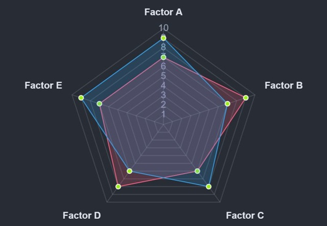

# Radar Graph Component

This document explains the `radar-graph` library, focusing on its purpose, installation, usage, and data structure.

## What is `radar-graph`?

`radar-graph` is a React component library designed to facilitate the creation and display of radar charts within React applications. It simplifies the process of visualizing multi-variable data in a radial format, making it easy to compare different entities across several quantitative metrics.

## Installation

To use the `radar-graph` library in your project, you need to install it using npm. Open your terminal in your project's root directory and run the following command:

```bash
npm install radar-graph
```

This command will download the library and add it to your project's dependencies.

## Importing the Library

Once installed, you can import the `RadarGraph` component into any of your React components (e.g., `App.js`, `Dashboard.js`, etc.) where you intend to use it. Add the following line at the top of your JavaScript or TypeScript file:

```javascript
import RadarGraph from 'radar-graph';
```

This statement makes the `RadarGraph` component available for use in your component's JSX.

## Data Structure

The `RadarGraph` component requires data to be passed via a `data` prop. This `data` prop must be an object with two main properties: `labels` and `datasets`.

### `labels`

-   An array of strings.
-   Each string represents a label for an axis (or "factor") on the radar chart.
-   The order of labels corresponds to the order of data points in each dataset.

### `datasets`

-   An array of objects, where each object represents a single data series to be plotted on the radar chart.
-   Each dataset object can have the following properties:
    -   `label` (string, optional): A name for the dataset, used in the chart's legend.
    -   `data` (array of numbers): The actual numerical values for each label. The length of this array must match the length of the `labels` array.
    -   `backgroundColor` (string, optional): The fill color for the area covered by this dataset on the radar chart (e.g., `'rgba(255, 99, 132, 0.2)'`).
    -   `borderColor` (string, optional): The color of the lines connecting the data points for this dataset (e.g., `'rgba(255, 99, 132, 1)'`).
    -   `borderWidth` (number, optional): The thickness of the border lines.

### Example Data Structure

Here's an example of how the `chartData` object should be structured:

```javascript
const chartData = {
  labels: ['Factor A', 'Factor B', 'Factor C', 'Factor D', 'Factor E'],
  datasets: [
    {
      label: 'Dataset 1',
      data: [7, 9, 6, 8, 7], // Values corresponding to Factor A, B, C, D, E
      backgroundColor: 'rgba(255, 99, 132, 0.2)',
      borderColor: 'rgba(255, 99, 132, 1)',
      borderWidth: 1,
    },
    {
      label: 'Dataset 2',
      data: [9, 7, 8, 6, 9], // Values corresponding to Factor A, B, C, D, E
      backgroundColor: 'rgba(53, 162, 235, 0.2)',
      borderColor: 'rgba(53, 162, 235, 1)',
      borderWidth: 1,
    },
  ],
};
```

### Rendering the `RadarGraph` component

Once you have your `chartData` defined, you can render the `RadarGraph` component by passing the `chartData` object to its `data` prop:

```jsx
<RadarGraph data={chartData} />
```

This structured data allows the `RadarGraph` component to correctly render the radar chart with multiple datasets and their respective values across defined factors.

## Visual Example

Here's a visual representation of a radar chart generated by the `radar-graph` component:

